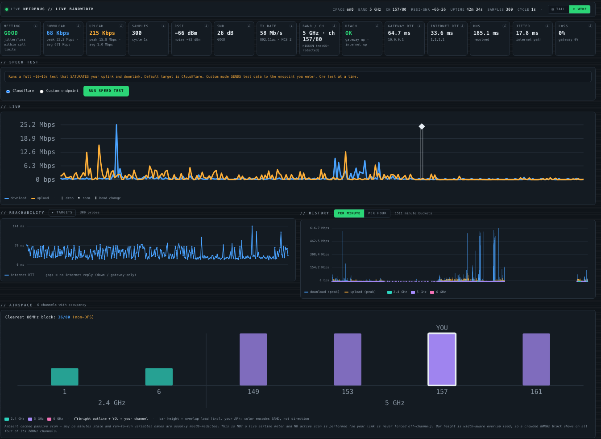
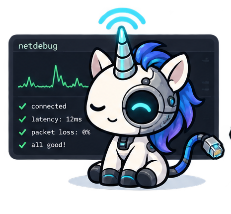
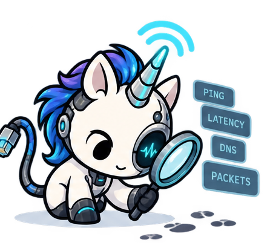

# netdebug

<p align="center">
  
</p>

[](https://github.com/MonkeyIsNull/netdebug/actions/workflows/ci.yml)
[](https://github.com/MonkeyIsNull/netdebug/releases/latest)


-brightgreen)

-lightgrey)

[](https://github.com/MonkeyIsNull/netdebug/commits/main)
[](https://github.com/MonkeyIsNull/netdebug/issues)
[](LICENSE)

**Monitor and debug your Wifi via the cli or in your browser.**

Ok, so this project was developed because I was getting constantly kicked off my home wifi and though there HAD to be a better way to debug this garbage. And none of the damn Mac tools are, frankly, worth a shit. So, here ya go. Have fun with it.

Run one command and netdebug opens a dashboard on `127.0.0.1`. It watches your throughput, signal, reachability, the Wi-Fi airspace around you, and which apps are using the network — and it keeps a running history. So when something goes wrong (add slowdown, a 2am drop, the band-steer that tanked your call), you can see exactly *when* and *why* instead of guessing.


- **No sudo, ever.** netdebug only runs password-free macOS tools. It never asks for admin rights — which is also what lets it run quietly at login.
- **Loopback only.** The dashboard is served on `127.0.0.1` and nowhere else. There's no option to put it on your network.
- **One small binary, no dependencies.** Pure Go standard library. The dashboard is a single self-contained page — no CDN, no web fonts, no outside requests.
- **Read-only.** It measures and reports. It never changes your network settings.


## Install

Grab it with Go:

```sh
go install github.com/MonkeyIsNull/netdebug@latest
```

Or build from source (nothing to download — it's standard-library only):

```sh
git clone https://github.com/MonkeyIsNull/netdebug
cd netdebug
go build -o netdebug .
```

You'll need Go 1.26 or newer.

## Quick start

```sh
./netdebug --serve
```

Open **http://127.0.0.1:8099/** in your browser. If that port's taken, netdebug grabs the next free one and prints the real URL. Press Ctrl-C to stop.



## Dashboard



The live dashboard (`--serve`) is the heart of netdebug. It refreshes every second and puts everything on one page:

- **Live throughput** — your up/down speeds right now, colored by Wi-Fi band so a slowdown that lines up with a band change jumps out.
- **Reachability** — gateway and internet round-trip time, packet loss, jitter, and DNS health, with a per-target breakdown. It pauses on battery or a locked screen to save power (turn that off with `--no-power-gating`).
- **History** — a per-minute and per-hour chart that survives restarts, so you can scroll back through the day.
- **Airspace** — the Wi-Fi networks around you, how crowded each channel is, and the clearest 80 MHz block to aim for. This is a passive read — netdebug never scans the air or knocks you off your channel.
- **Outage journal** — a timestamped log of real outages (a single blip is filtered out), each with a best-guess cause.
- **Band / channel change journal** — a timestamped log of every band-steer and channel hop, so "wait, when did I get moved to 2.4?" is a glance, not a mystery.
- **Top talkers** — which apps are using the network, ranked by upload. Click one to see what it is and who it's talking to.
- **Speed test** — a one-click download / upload / latency test, right from the page.

Two optional extras when you serve:

- `--alerts` — native macOS notifications when you drop, get band-steered, or your call quality tanks.
- `--throttle-watch` — an occasional, rate-limit-friendly download sample to catch peak-hour ISP throttling.

## Command line options



Besides the live dashboard, netdebug can run a single bottom-up health check of whatever network you're on — DHCP → route → gateway → internet → DNS → web — and tell you the first thing that's broken (that's your problem):

```sh
./netdebug                 # check the current network; saves a report to ./net-tests/
#   switch networks by hand in the macOS Wi-Fi menu
./netdebug                 # check the other one
./netdebug --compare       # put the two latest reports side by side
```

The result names the first failing layer, for example: *"NO UPSTREAM: the gateway answers but the internet doesn't — this network's uplink is down."* Add `--all` (or `--signal` / `--ipv6` / `--proxy` / `--extras`) for signal sampling, IPv6 checks, VPN/proxy detection, and more.

> There's a `--live` mode that switches networks for you, but recent macOS usually blocks it (CoreWLAN `Error -3900`), so switching by hand and using `--compare` is the reliable way.

## One-shot commands

Each of these runs once, prints to your terminal, and exits — no server:

```sh
./netdebug --sample          # live up/down rates in the terminal
./netdebug --speed           # download / upload / latency
./netdebug --bufferbloat     # latency-under-load grade, A–F
./netdebug --airspace        # neighbors, channel crowding, clearest block
./netdebug --top-talkers     # per-app bandwidth, biggest uploader first
./netdebug --proc <pid>      # what a process is and who it's connected to
./netdebug --status          # one-line health summary (from a running --serve)
./netdebug --report          # daily / weekly rollup from saved history
```

See [examples/](examples/) for a fuller tour with sample output.

## Run it all day


Want netdebug always on? Install it as a per-user login agent — no root, just your own session:

```sh
./netdebug --install-launchd                 # start now, and at every login
./netdebug --install-launchd --port 9000     # pin a port
./netdebug --launchd-status                  # is it running / crash-looping?
./netdebug --uninstall-launchd               # remove it
```

It installs to `~/Library/LaunchAgents/com.cobenian.netdebug.plist` and logs to `~/Library/Logs/netdebug/netdebug.log` (which doesn't rotate, so trim it now and then). Point it at a stable binary path like `/usr/local/bin/netdebug` — it will refuse a throwaway `go run` path on purpose.

## Where the history lives

netdebug folds samples into buckets on disk so your charts survive restarts:

- **Location:** `~/Library/Application Support/netdebug/history`
- **Kept for:** per-minute buckets 48 hours, per-hour buckets 90 days.
- **Change it:** `--history-dir /abs/path`, or `history_dir` / `minute_ttl_hours` / `hour_ttl_days` in a config file.

The outage and roam journals sit alongside as append-only JSONL.

## Wtf (in more detail)

- **Loopback only.** The server binds `127.0.0.1` and re-checks the real socket address after binding, so it can never end up on `0.0.0.0`, `::`, or your LAN. There's no flag to change that, and guard tests enforce it.
- **No sudo.** It reads the radio with `system_profiler` and `ifconfig`, never `wdutil` or `sudo`, and never prompts for a password. Top talkers use `nettop` the same way — if a system process isn't visible to your user, netdebug just says "unavailable" instead of escalating.
- **Self-contained page.** The dashboard HTML has zero external URLs — no CDN, no web fonts, no `<link>`, no `url()`. Charts are inline SVG, and anything user-facing is written with `textContent`, never `innerHTML`.

## Configuration

You don't need a config file — netdebug runs fine on its defaults. To tweak things, copy `config.example.json` to `config.json` and pass `--config config.json`. The example file lists every option.

## Some stuff that's probably important, or not.

- **macOS on Apple Silicon.** It reads macOS command output, so it's Mac-only.
- **It only looks, never touches.** No network settings are changed.
- **macOS hides some radio details.** Without Location permission, macOS redacts your SSID and BSSID. netdebug still reports link state honestly, and you can label your network with `--ssid` (or `ssid_label` in config).
- **Top talkers are per-user.** Some system processes need admin rights to identify, and netdebug won't escalate to get them.

## Learn more


- [docs/ARCHITECTURE.md](docs/ARCHITECTURE.md) — how it's built, the invariants, and a file-by-file map for contributors.
- [CHANGELOG.md](CHANGELOG.md) — what landed, by phase.
- [examples/](examples/) — common commands and sample output.
- [scripts/wifilog.sh](scripts/wifilog.sh) — a companion script for digging through macOS Wi-Fi *logs* after the fact (see [scripts/README.md](scripts/README.md)).

## Building and testing

```sh
go build     # compile the binary
go test      # run the tests (they run offline — no network needed)
go vet       # static checks
```

Tests are table-driven over every macOS-output parser and all the decision logic, and they run offline — no network needed. A set of guard tests keeps the loopback-only and self-contained-HTML promises honest.

## Contributing

Issues and pull requests are welcome. Found a bug or have an idea? Open an issue. Want to send a change? Fork, make it, and open a PR — please run `gofmt` and `go test` first (CI checks gofmt, `go vet`, build, and tests on macOS).

## License

MIT — free to use, change, and share. See [LICENSE](LICENSE). Copyright (c) 2026 Adam Guyot.
